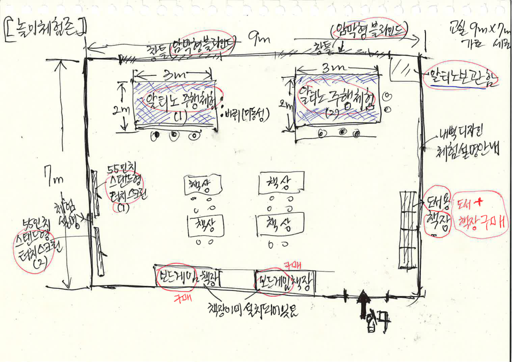
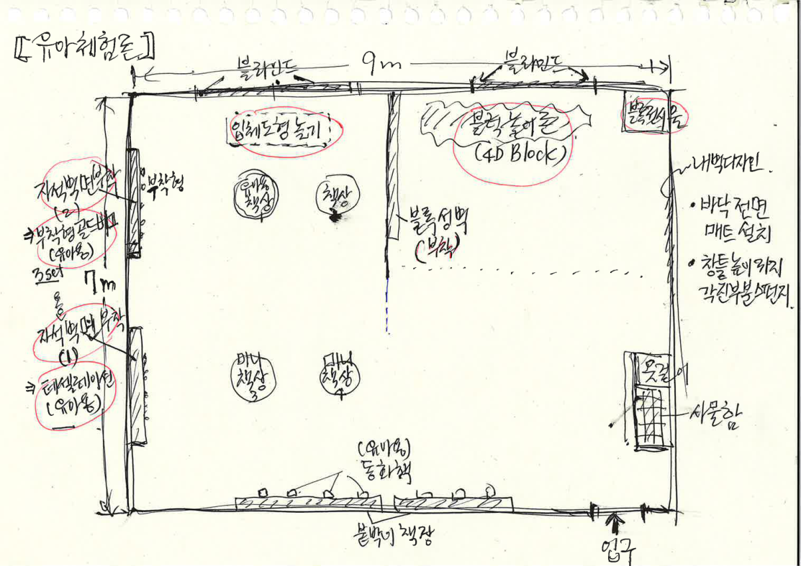
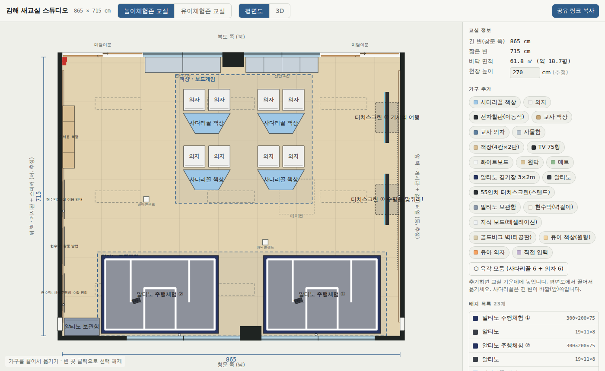
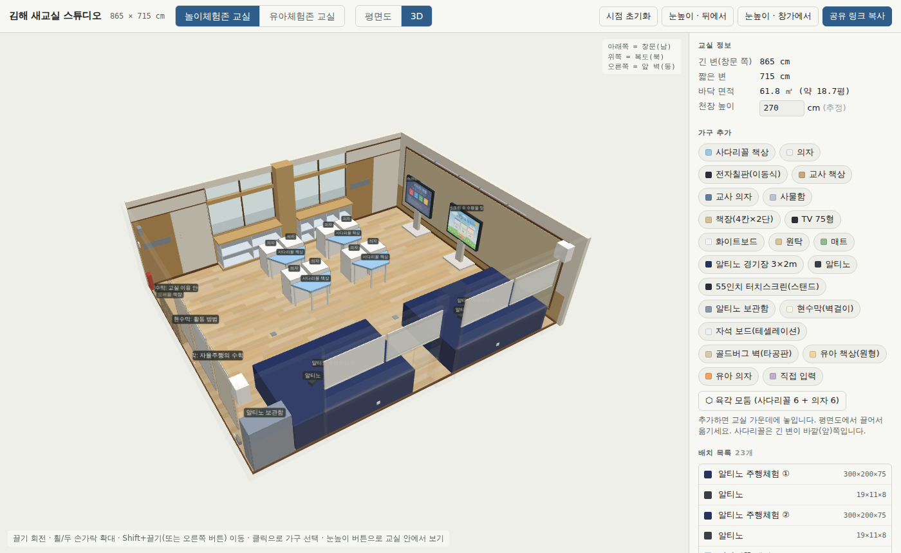
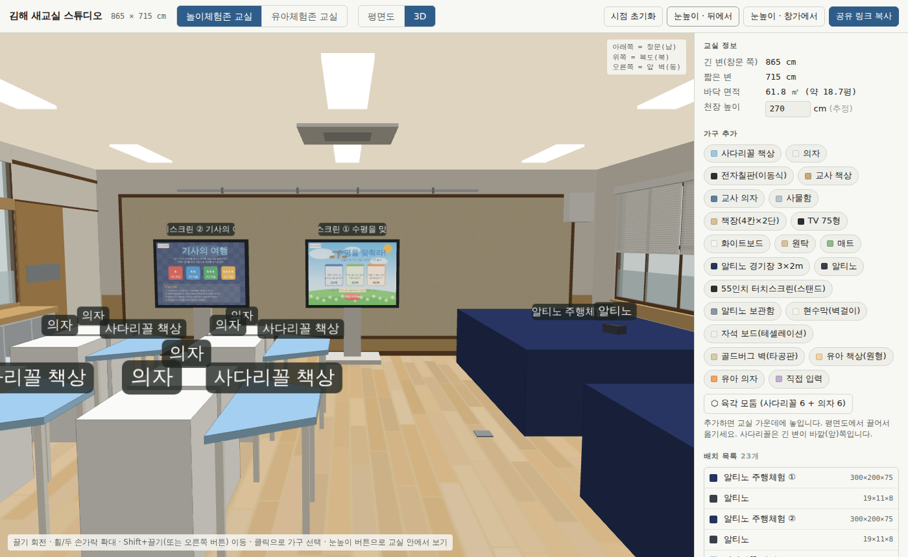
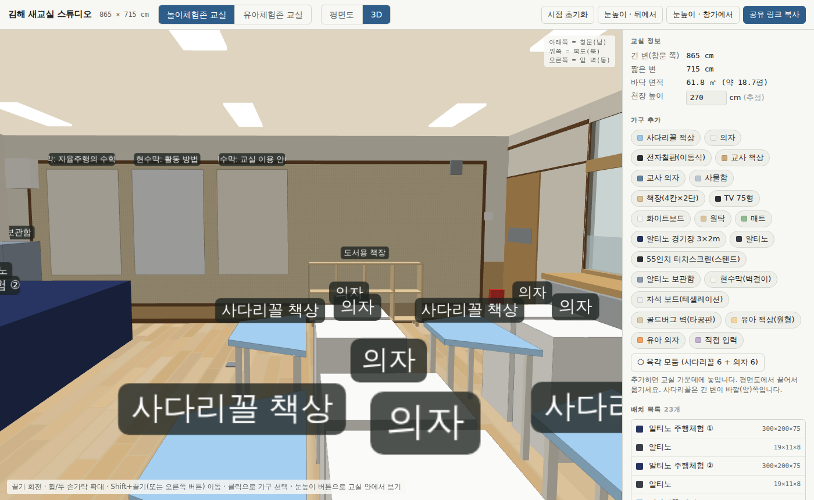
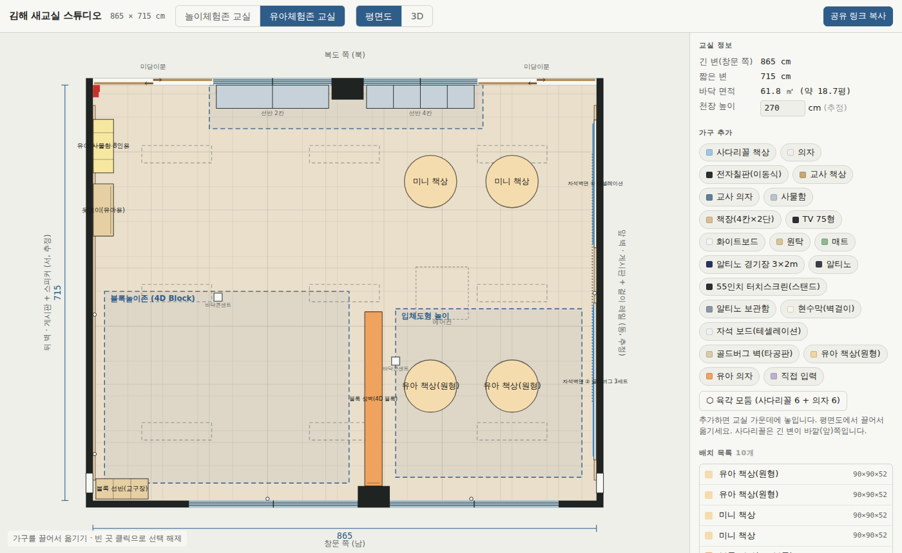
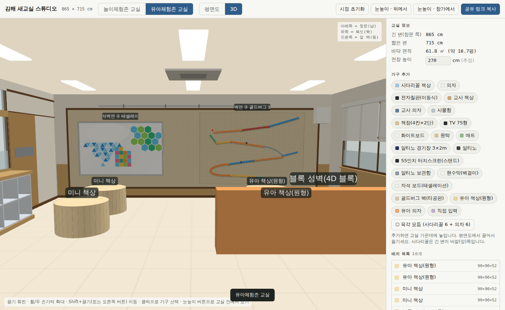
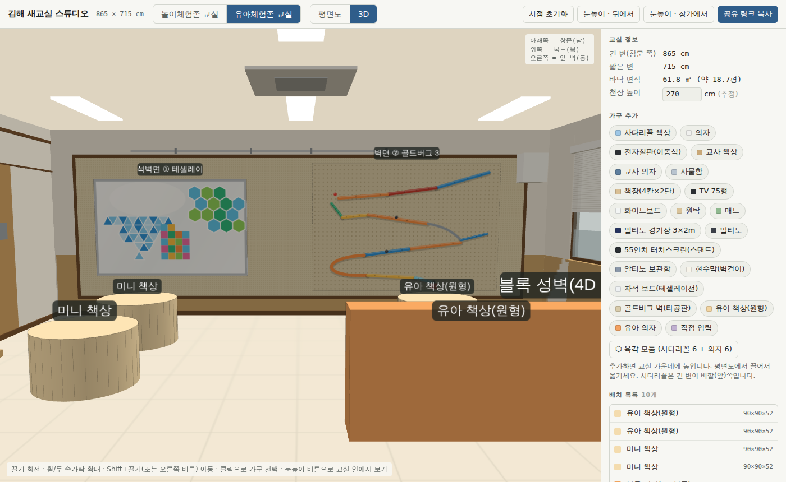
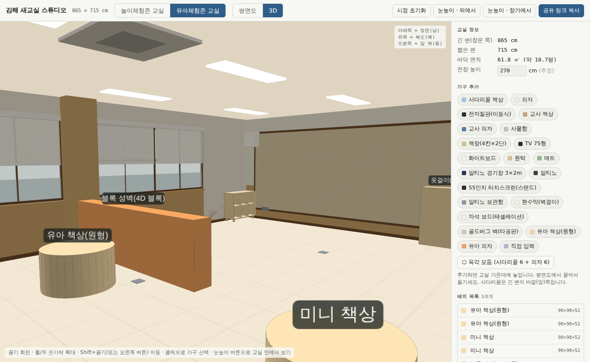

# 김해 새교실 스튜디오 — 인수인계 문서

작성일 2026-09-09. 이 문서 하나로 다른 앱(웹, 유니티, 파워포인트 도면 등)에 같은 교실과 배치를 다시 만들 수 있도록 좌표·치수·규약·가정을 모두 적었습니다.

- 웹앱(현재 배포): https://i20091119-ai.github.io/2026gimhaenewclass/
- 저장소: https://github.com/i20091119-ai/2026gimhaenewclass (브랜치 `claude/fervent-goldberg-myplqk`)
- 핵심 파일: `index.html` 하나(HTML+CSS+JS 약 1,000줄). 3D 엔진은 `vendor/three.min.js`(three.js r128, MIT).
- 배치 데이터: `docs/놀이체험존-배치안.json`, `docs/유아체험존-배치안.json`
- 결정 기록: `docs/메모.md`

---

## 1. 교실 기본 정보

| 항목 | 값 |
|---|---|
| 긴 변(창문 쪽) | **865 cm** |
| 짧은 변 | **715 cm** |
| 바닥 면적 | 61.8 ㎡ (약 18.7평) |
| 천장 높이 | 270 cm **(추정, 미실측)** |
| 교실 수 | 2곳. 놀이체험존 교실과 유아체험존 교실은 바로 옆 교실이며 빈 교실 구조가 같음 |

### 좌표계 (모든 수치는 cm)

- 원점: 창문 벽과 뒤 벽이 만나는 바닥 모서리.
- **x**: 0 → 865, 뒤 벽(서)에서 앞 벽(동) 방향.
- **y**: 0 → 715, 창문 벽(남)에서 복도 벽(북) 방향.
- **z**: 바닥에서 위로.
- 평면도는 창문이 아래, 복도가 위, 앞 벽이 오른쪽.
- 3D 엔진(three.js)에서는 `X = x, Y = z, Z = -y` 로 매핑.

### 벽 이름

| 앱 이름 | 방향 | 특징 | 사진 |
|---|---|---|---|
| 창문 벽 | 남 (y=0) | 창 2단 두 묶음, 가운데 기둥, 목재 징두리, 창턱 90 cm | 사진 2 |
| 복도 벽 | 북 (y=715) | 양 끝 미닫이문, 가운데 기둥 좌우로 창+붙박이 칸막이 선반 | 사진 4, 6 |
| 앞 벽 (추정) | 동 (x=865) | 타공 게시판, 위쪽 걸이 레일, 가운데 콘센트 | 사진 1, 3, 6 |
| 뒤 벽 (추정) | 서 (x=0) | 타공 게시판, 스피커, 온도조절기, 소화기. 입구(미닫이문 0–207) 쪽 | 사진 5 |

사용자 스케치(아래 이미지)는 창문이 위, 입구가 오른쪽 아래로 그려져 있어 앱 평면도를 180° 돌린 방향입니다. 스케치 왼쪽 벽 = 앱의 앞 벽(동), 스케치 오른쪽 벽 = 앱의 뒤 벽(서).

> 참고 사진 원본(교실 6장, 가구·경기장 사진)은 대화 중에 붙여넣기로 받아 저장소에 파일로 없습니다. `docs/images/` 에 넣어 두면 좋습니다.




---

## 2. 빈 교실 구조 (SPEC)

사진에서 눈대중으로 잡은 값이라 **±20 cm 오차**가 있을 수 있습니다. 벽 두께는 12 cm로 방 바깥쪽에 그립니다.

### 창문 벽 (남, y=0)

| 요소 | x 범위 | 높이 | 비고 |
|---|---|---|---|
| 벽(막힘) | 0–165, 800–865 | 0–270 | 징두리 목재 0–90 |
| 창 묶음 B | 165–455 | 90–230 | 2열×2단, 중간 가로틀 160, 아래 40 cm 불투명 필름 |
| 기둥 | 455–510 | 0–270 | 실내로 25 cm 돌출 |
| 창 묶음 A | 510–800 | 90–230 | 위와 동일 |
| 창턱 | 창 전체 | 87–90 | 4 cm 돌출 |
| 블라인드 | 창 각 열 | 상단에서 절반(약 160)까지 내려옴 | 흰색 가로 슬랫, 헤드박스 230–238 |
| 콘센트 | x=300, 650 | 28–36 | |

### 복도 벽 (북, y=715)

| 요소 | x 범위 | 높이 | 비고 |
|---|---|---|---|
| 미닫이문 ① (입구) | 0–207 | 0–210 | 두 짝, 위 채광창 212–250 |
| 창 + 붙박이 선반 | 207–410 | 창 100–200, 채광창 212–250 | 선반 212–405, 깊이 40, 높이 90, **2칸×2단** 오픈형 |
| 기둥 | 410–465 | 0–270 | 실내로 25 cm 돌출 |
| 창 + 붙박이 선반 | 465–660 | 창 100–200, 채광창 212–250 | 선반 470–655, 깊이 40, 높이 90, **4칸×2단** 오픈형 |
| 미닫이문 ② | 660–865 | 0–210 | 두 짝 |
| 소화기 | x≈8 | 0–50 | 뒤 벽 모서리 |

### 뒤 벽 (서, x=0)

| 요소 | y 범위 | 높이 | 비고 |
|---|---|---|---|
| 타공 게시판 | 35–680 | 30–230 | 어두운 목재 테두리, 벽에서 3.5 cm 돌출 |
| 흰 스피커 박스 | 13–47 | 195–235 | 창문 모서리 쪽 |
| 작은 스피커 | 632–648 | 215–235 | |
| 온도조절기 | 684–696 | 150–162 | |
| 소화기 | 694–706 | 0–50 | |
| 밸브 | 60–80 | 25–35 | |
| 콘센트 | y=80, 320 | 28–36 | |

### 앞 벽 (동, x=865)

| 요소 | y 범위 | 높이 | 비고 |
|---|---|---|---|
| 타공 게시판 | 35–680 | 30–230 | 뒤 벽과 동일 |
| 걸이 레일 | 170–600 | 240 | 고리 4개 |
| 흰 스피커 박스 | 13–47 | 195–235 | |
| 콘센트 | y=357 | 110–118 | 게시판 가운데 |

### 천장·바닥

| 요소 | 위치 |
|---|---|
| LED 패널 3×3 | 중심 x = 144, 432, 720 / y = 119, 357, 596. 크기 120×30 |
| 천장형 에어컨 1대 | 중심 (600, 357), 90×90 |
| 바닥 콘센트 2개 | (215, 350), (520, 240), 14×14 |
| 바닥 | 밝은 원목 무늬. 유아체험존은 위에 크림베이지 60 cm 타일 매트 전면 |

---

## 3. 데이터 모델

### 가구 항목(item) 스키마

```json
{ "id": "f12-ab3c", "name": "사다리꼴 책상", "shape": "trap",
  "w": 120, "d": 52, "h": 72, "x": 560, "y": 400, "z": 0, "rot": 180,
  "color": "#9ec7e6", "cols": 4, "rows": 2, "art": "tess", "app": "balance" }
```

| 필드 | 의미 |
|---|---|
| w, d, h | 가로(앞면 기준 좌우), 깊이(앞뒤), 높이. cm |
| x, y | 평면 **중심** 좌표 |
| z | 바닥에서 띄운 높이(벽걸이용). 물체 아랫면 높이 |
| rot | 위에서 봤을 때 반시계 방향 회전(도) |
| shape | 아래 표 |
| cols, rows | 칸막이 책장(cubby) 칸 수 |
| art | 자석 보드 그림: `tess`(테셀레이션) / `gold`(골드버그) |
| app | 터치스크린 화면: `balance`(수평을 맞춰라) / `knight`(기사의 여행) |

**앞면 규약**: `rot = 0` 일 때 물체의 앞면은 **-y(창문) 쪽**. 벽에 붙일 때 앞면이 교실 안을 보게 하려면 — 창문 벽 0, 복도 벽 180, 뒤 벽(서) 90, 앞 벽(동) 270. 사다리꼴은 긴 변이 앞면, 칸막이 책장은 트인 면이 앞면, 스크린·보드는 화면이 앞면.

### shape 종류

| shape | 설명 | 3D 표현 |
|---|---|---|
| box | 직육면체 | 박스 |
| circle | 타원 기둥(w, d = 지름) | 원기둥 |
| trap | 60° 사다리꼴 책상. 윗변(안쪽) = w − 1.155·d | 상판 4 cm + 다리 4개 |
| screen | 스탠드형 화면 | 받침(폭 0.6w, 6 cm) + 기둥(75 cm) + 패널(75~h) + 화면 텍스처 |
| cubby | 앞이 트인 칸막이 책장 | 뒤판·옆판·선반·세로 칸막이(판 2 cm), 다리 8 cm |
| field | 알티노 경기장 | 남색 상자 + 상판 코스 텍스처 + 바퀴 4개 |
| board | 벽걸이 자석 보드 | 얇은 판 + 앞면 그림 텍스처 |

### 구역(zone) — 평면도 점선 표시용

```json
{ "name": "알티노 주행체험", "x1": 90, "x2": 830, "y1": 0, "y2": 215 }
```

### 저장·공유 형식

- 브라우저 저장: `localStorage["gimhae-newclass-v1-<교실이름>"]` = `{items, zones, H, opts, layout}`, 현재 교실은 `gimhae-newclass-v1-room`, 보기 상태는 `gimhae-newclass-v1-view`.
- 공유 링크: `주소#d=` + base64(UTF-8 JSON `{room, items, zones, H, mat}`). 열면 해당 교실 상태로 들어감.
- JSON 내보내기/불러오기: 위와 같은 JSON. `docs/*.json`이 이 형식.
- 배치안 버전: 코드의 `LAYOUT_VERS` 를 올리면, 배치안을 손대지 않은 사용자의 저장본은 자동 갱신되고, 손댄 사용자는 안내만 받음.

---

## 4. 배치안 ① 놀이체험존 교실




| 이름 | 모양 | W×D×H (cm) | 중심 X | 중심 Y | 바닥높이 Z | 회전° | 색 | 비고 |
|---|---|---|---|---|---|---|---|---|
| 알티노 주행체험 ① | field | 300×200×75 | 665 | 106 | 0 | 0 | `#26335f` |  |
| 알티노 | box | 19×11×8 | 605 | 90 | 75 | 20 | `#3a3f47` |  |
| 알티노 주행체험 ② | field | 300×200×75 | 250 | 106 | 0 | 0 | `#26335f` |  |
| 알티노 | box | 19×11×8 | 190 | 90 | 75 | 20 | `#3a3f47` |  |
| 사다리꼴 책상 | trap | 120×52×72 | 560 | 400 | 0 | 180 | `#9ec7e6` |  |
| 의자 | box | 55×55×80 | 528 | 460 | 0 | 0 | `#f0f0ee` |  |
| 의자 | box | 55×55×80 | 592 | 460 | 0 | 0 | `#f0f0ee` |  |
| 사다리꼴 책상 | trap | 120×52×72 | 370 | 400 | 0 | 180 | `#9ec7e6` |  |
| 의자 | box | 55×55×80 | 338 | 460 | 0 | 0 | `#f0f0ee` |  |
| 의자 | box | 55×55×80 | 402 | 460 | 0 | 0 | `#f0f0ee` |  |
| 사다리꼴 책상 | trap | 120×52×72 | 560 | 545 | 0 | 180 | `#9ec7e6` |  |
| 의자 | box | 55×55×80 | 528 | 605 | 0 | 0 | `#f0f0ee` |  |
| 의자 | box | 55×55×80 | 592 | 605 | 0 | 0 | `#f0f0ee` |  |
| 사다리꼴 책상 | trap | 120×52×72 | 370 | 545 | 0 | 180 | `#9ec7e6` |  |
| 의자 | box | 55×55×80 | 338 | 605 | 0 | 0 | `#f0f0ee` |  |
| 의자 | box | 55×55×80 | 402 | 605 | 0 | 0 | `#f0f0ee` |  |
| 터치스크린 ① 수평을 맞춰라! | screen | 130×60×170 | 832 | 350 | 0 | 270 | `#2b2f33` | 화면: balance |
| 터치스크린 ② 기사의 여행 | screen | 130×60×170 | 832 | 560 | 0 | 270 | `#2b2f33` | 화면: knight |
| 알티노 보관함 | box | 90×45×120 | 50 | 23 | 0 | 180 | `#8a97a8` |  |
| 도서용 책장 | cubby | 160×30×90 | 16 | 510 | 0 | 90 | `#d9bf94` | 4칸×2단 |
| 현수막: 자율주행의 수학 원리 | box | 100×1.5×150 | 5 | 110 | 72 | 90 | `#f7f4ea` |  |
| 현수막: 활동 방법 | box | 100×1.5×150 | 5 | 230 | 72 | 90 | `#eef4f7` |  |
| 현수막: 교실 이용 안내 | box | 100×1.5×150 | 5 | 350 | 72 | 90 | `#f7f0e6` |  |

구역
| 구역 | x 범위 | y 범위 |
|---|---|---|
| 알티노 주행체험 | 90–830 | 0–215 |
| 책상 · 보드게임 | 290–640 | 340–670 |




특이사항
- 알티노 경기장 2개는 창턱 바로 앞(y=6)까지 붙였고, 사이에 기둥이 옴. 경기장 앞 의자는 없음.
- 사다리꼴 책상 4개는 긴 변이 복도 쪽(의자 쪽)을 향함. 의자는 책상당 2개.
- 터치스크린 2대는 앞 벽에 붙여 교실 안쪽을 봄. 화면은 원본 이미지가 아니라 같은 구성으로 다시 그린 것.
- 현수막 3장은 뒤 벽 게시판 위, 책상 높이 72 cm에서 시작. 내용: 자율주행의 수학 원리 / 활동 방법 / 교실 이용 안내.
- 복도 벽 붙박이 선반(보드게임 책장)은 기존 시설.

---

## 5. 배치안 ② 유아체험존 교실




| 이름 | 모양 | W×D×H (cm) | 중심 X | 중심 Y | 바닥높이 Z | 회전° | 색 | 비고 |
|---|---|---|---|---|---|---|---|---|
| 유아 책상(원형) | circle | 90×90×52 | 720 | 197 | 0 | 0 | `#f4dcae` |  |
| 유아 책상(원형) | circle | 90×90×52 | 580 | 197 | 0 | 0 | `#f4dcae` |  |
| 미니 책상 | circle | 90×90×52 | 720 | 549 | 0 | 0 | `#f4dcae` |  |
| 미니 책상 | circle | 90×90×52 | 580 | 549 | 0 | 0 | `#f4dcae` |  |
| 블록 성벽(4D 블록) | box | 30×300×90 | 482 | 175 | 0 | 0 | `#f0a35e` |  |
| 블록 선반(교구장) | cubby | 90×35×75 | 50 | 20 | 0 | 180 | `#e6cfa3` | 3칸×2단 |
| 자석벽면 ② 골드버그 3세트 | board | 270×3×185 | 863 | 205 | 38 | 270 | `#d8cbaa` | 그림: gold |
| 자석벽면 ① 테셀레이션 | board | 220×4×140 | 863 | 545 | 60 | 270 | `#eef1f3` | 그림: tess |
| 옷걸이(유아용) | box | 90×35×110 | 18 | 500 | 0 | 90 | `#e6cfa3` |  |
| 유아 사물함 8인용 | cubby | 92×35×90 | 18 | 610 | 0 | 90 | `#f6e7a1` | 4칸×2단 |

구역
| 구역 | x 범위 | y 범위 |
|---|---|---|
| 입체도형 놀이 | 520–840 | 40–330 |
| 블록놀이존 (4D Block) | 20–440 | 30–360 |
| 동화책 (붙박이 책장) | 200–670 | 640–715 |

바닥 전면 매트: 켬 (크림베이지 `#e9dfcb`, 60 cm 타일).




특이사항
- 의자는 일단 없음.
- 블록 성벽은 창문 벽 가운데 기둥에서 안쪽으로 뻗음(4D 블록, EVA 6×3×2 cm를 쌓은 유아 눈높이 성벽으로 가정).
- 자석벽면 두 장은 앞 벽 게시판(가로 645, 높이 200) 안에 비율 맞춰 배치. 테셀레이션은 흰 자석판 위에 파란 삼각형·색 정사각형·색 육각형, 골드버그는 타공판 위에 색색의 경사로·튜브·통.
- 스케치의 "창틀 높이까지 모서리 스펀지", "내벽 디자인"은 표현하지 않음.

---

## 6. 렌더링 구현 요약 (이식 시 참고)

| 부분 | 구현 | 이식 팁 |
|---|---|---|
| 평면도 | 순수 SVG. viewBox = (865+180)×(715+180), 여백 90. `px(x)=90+x`, `py(y)=90+(715−y)`. 가구는 `<g transform="translate rotate(−rot)">` | 어떤 2D 캔버스든 같은 식으로 그림 |
| 3D | three.js r128, Lambert 재질, 반구광+방향광 2개. 벽은 BoxGeometry 조합, 유리는 반투명 박스 | 다른 엔진이면 SPEC 표대로 박스만 쌓으면 됨 |
| 카메라 | 원근 카메라 + 자체 구현 궤도 조작(끌기 회전, 휠 확대, Shift/오른쪽 버튼 이동, 두 손가락 핀치) | |
| 조감 처리 | 카메라가 천장(270)보다 높으면 천장 숨김, 카메라를 향한 벽 2면은 불투명도 0.08 | |
| 눈높이 프리셋 | 뒤에서: 위치 (≈47, 167, 358) 동쪽을 봄. 창가에서: 위치 (432, 167, ≈120) 북쪽을 봄 | |
| 텍스처 | 모두 캔버스로 절차 생성: 바닥 원목, 타공판 점, 블라인드 슬랫, 매트 타일, 경기장 코스, 테셀레이션/골드버그 그림, 터치스크린 화면 | 이미지 파일이 필요하면 브라우저에서 `canvas.toDataURL()`로 뽑을 수 있음 |
| 경기장 코스 | 바깥 벽 + 창문 쪽 가운데 ㄷ자 홈 + 복도 쪽에서 올라오는 기둥 벽 2개 (폴리라인 `fieldCourse(w,d)`) | |
| 이름표 | 스프라이트(캔버스 텍스트), 물체 위 14 cm | |

---

## 7. UI 기능

- 상단: 교실 전환(놀이체험존/유아체험존), 보기 전환(평면도/3D), 시점 초기화, 눈높이 2종, 공유 링크 복사.
- 오른쪽 패널: 교실 정보(천장 높이 편집), 가구 프리셋 추가, 육각 모둠(사다리꼴 6 + 의자 6 자동 배치), 배치 목록, 선택 항목 편집(이름·크기·위치·회전·모양·색·바닥높이, 90° 회전, 복제, 삭제), 보기 옵션(격자, 5 cm 스냅, 천장 설비, 이름표, 블라인드, 전면 매트), 저장·공유(배치안 되돌리기, JSON 복사/불러오기, 전체 비우기), 사진↔벽 대조표.
- 평면도: 가구 끌기, 빈 곳 클릭 선택 해제, 방향키 이동(Shift=10 cm), R 회전, Delete 삭제.
- 3D: 가구 클릭 선택.

### 프리셋 치수

| 프리셋 | W×D×H | 비고 |
|---|---|---|
| 사다리꼴 책상 | 120×52×72 | 하늘색 상판, 6개 = 육각 모둠 |
| 의자 | 55×55×80 | 흰 셸 + 검은 방석 |
| 전자칠판(이동식) | 195×70×190 | 화면 아랫단 75 |
| 교사 책상 / 교사 의자 | 140×70×75 / 55×55×95 | |
| 사물함 | 120×40×120 | |
| 책장(4칸×2단) | 160×30×90 | 원목 오픈형 |
| TV 75형 / 화이트보드 | 170×10×100 (z 90) / 240×6×120 (z 90) | |
| 원탁 / 매트 | 120×120×70 / 200×100×5 | |
| 알티노 경기장 | 300×200×75 | 바퀴 이동식 |
| 알티노 | 19×11×8 | |
| 55인치 터치스크린(스탠드) | 130×60×170 | |
| 알티노 보관함 | 90×45×120 | |
| 현수막(벽걸이) | 100×1×150 (z 72) | |
| 자석 보드(테셀레이션) | 180×4×120 (z 40) | |
| 골드버그 벽(타공판) | 240×3×180 (z 15) | |
| 유아 책상(원형) / 유아 의자 | 90×90×52 / 32×32×55 | |

---

## 8. 배포·실행

- GitHub Pages: `.github/workflows/pages.yml` 이 지정 브랜치 푸시마다 저장소 루트를 배포. 저장소 Settings → Pages → Source = GitHub Actions 로 설정되어 있음.
- 로컬 실행: `index.html` 을 브라우저로 열면 됨(서버 불필요). `vendor/three.min.js` 가 없으면 CDN(cdnjs → jsdelivr)으로 대체 로딩.
- 브라우저 지원: WebGL이 되는 최신 크롬/엣지/사파리. 모바일은 패널이 아래로 내려감.

---

## 9. 확인이 필요한 가정

1. 천장 높이 270 cm (미실측).
2. 창·문·기둥·선반 위치는 사진 눈대중 (±20 cm).
3. 앞/뒤 벽 구분(레일 벽 = 앞)은 추정.
4. 가구 치수는 제품 검색 기준 어림: 4D 블록 성벽, 철제 자석판 240×120 / 180×120, 유아 사물함 8인용 92×35×90, 옷걸이 90×35×110, 교구장 90×35×75, 원형 책상 지름 90.
5. 알티노 경기장 실제 치수(스케치 3×2 m 기준), 보관함 크기, 현수막 실제 크기.
6. 터치스크린 화면과 자석 보드 그림은 재현 그림이며 원본 이미지가 아님.

---

## 10. 다른 앱으로 옮길 때 순서

1. 1·2절의 좌표계와 SPEC 표로 빈 교실을 만든다(박스만으로 충분).
2. `docs/*.json` 의 items 를 읽어 shape별 규칙(3절)으로 가구를 놓는다. 회전은 반시계, 앞면 규약에 주의.
3. zones 를 평면도에 점선으로 표시한다.
4. 유아체험존은 바닥 매트를 켠다.
5. 텍스처가 필요하면 `index.html` 의 캔버스 그리기 함수(`floorTexture`, `boardTexture`, `blindTexture`, `matTexture`, `fieldCourse`, `artTexture`, `screenTexture`)를 그대로 옮기거나 브라우저에서 PNG로 추출한다.
6. 공유 링크 호환이 필요하면 `#d=` base64 JSON 형식을 그대로 읽어 준다.

## 부록: 이미지 목록 (`docs/images/`)

sketch-놀이체험존.png, sketch-유아체험존.png, 놀이체험존-평면도.png, 놀이체험존-3D.png, 놀이체험존-앞벽.png, 놀이체험존-터치스크린.png, 놀이체험존-현수막.png, 유아체험존-평면도.png, 유아체험존-3D.png, 유아체험존-자석벽면.png, 유아체험존-창문블라인드.png
